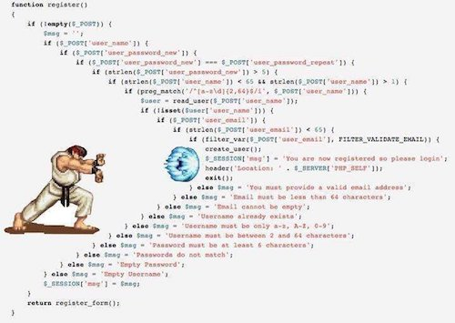

## `Readable Code`<br/>`in Scala`

@size[0.5em](パターンマッチ・for式編)

### `Scala関西Summit2018`

門脇 拓巳 (@blac_k_ey)

---

## 自己紹介

+ 門脇 拓巳 (Takumi Kadowaki)
+ 所属: 株式会社セプテーニ・オリジナル
  + 広告運用管理ツールPYXISの開発に関わる
+ GitHub: [NomadBlacky](https://github.com/NomadBlacky)
+ Twitter: [@blac_k_ey](https://twitter.com/blac_k_ey)

+++


「実践Scala入門」発売中!  
レビューを少しお手伝いさせていただきました🙇

「実践」の名にふさわしい充実した内容!  
必携の一冊です!

---

## 発表内容について

@size[0.8em](Scalaで読みやすいコードを書くためのTipsをご紹介します。)

+ ある程度Scalaの基本文法に慣れてきた
+ Scalaらしいコードを書けているか不安な人

…といった、初級者の方を対象としています。

---

## 謝辞

+++

## `Readable Code`<br/>`in Scala`

@size[0.5em](パターンマッチ・for式編)

### `Scala関西Summit2018`

門脇 拓巳 (@blac_k_ey)

+++

「パターンマッチ・for式編」

を加えさせていただきました🙇

---

## 「読みやすいコード」<br/>とはなんだろう?

+++

「読みにくいコード」から考える

+ ひと目で仕様を把握できない
+ 適切な機能・APIを使って実装されていない
+ ドキュメントが整備されていない
+ 複雑
+ 書式が統一されていない

+++

対して、「読みやすいコード」とは

+ ひと目で仕様が分かる
+ 適切な機能・APIを使って実装されている
+ ドキュメントが整備されている
+ シンプル
+ 書式が統一されている

+++

@size[0.8em](Scalaに限らず、読みやすいコードを書くためにできること)

+ 関数(メソッド)を小さく保つ
+ 命名規則
+ 適切な言語機能・APIを使う
+ ネストを深くしない
+ ドキュメントを書く
+ 副作用を起こすところを局所化する
+ ...

これらの要素はScalaも同様に役立ちます。

+++

今回は「Scala関西Summit」ということなので…

+ 適切な言語機能・APIを使う
+ シンプル

@size[0.8em](特にこの2つに対し、Scalaの言語機能を有効に使うことで、)  
@size[0.8em](Scalaらしい「読みやすい」コードを書けることを)  
@size[0.8em](目指していきましょう。)

---

## パターンマッチ編

+++

```scala
anyObject match {
  case 1 => "one"                      // 値のマッチング
  case d: Double => d.toString         // 型のマッチング
  case Some(x) => x.toString           // 構造のマッチング
  case s: String if 5 <= s.length => s // パターンガード
  case any => "Any"                    // 任意の値
}
```

match式のおさらい

+++

Q: 以下の条件を満たす関数を実装しましょう

```scala
case class User(name: Option[String], isActive: Boolean)
def extractUserNameWithTop10Chars(users: List[User]): List[String] = ???
```

+ `List[User]` に対して
+ `isActive` が `true` のものだけを抜き出し
+ 名前が10文字以上の場合は最初の5文字だけを抜き出し
+ `List[String]` を返す

+++

```scala
val userList = List(
  User(Some("user1"), isActive = true),
  User(None, isActive = true),
  User(Some("user3"), isActive = false),
  User(Some("user444444444444"), isActive = true),
  User(Some("user555555555555"), isActive = false),
  User(None, isActive = false),
  User(Some("user7"), isActive = true)
)

val expect = List("user1", "user4", "user7")

extractUserNameWithTop10Chars(userList) shouldBe expect
```

期待する動作

+++

```scala
def extractUserNameWithTop10Chars(users: List[User]): List[String] = {
  users
    .withFilter(u => u.isActive)
    .withFilter(u => u.name.isDefined)
    .map { user =>
      if (10 <= user.name.get.length) {
        user.name.get.take(5)
      } else {
        user.name.get
      }
    }
}
```

愚直に実装してみる

+++

```scala
def extractUserNameWithTop10Chars02(users: List[User]): List[String] = {
  users
    .withFilter(u => u.isActive)
    .withFilter(u => u.name.isDefined)
    .map { user =>
      user match {
        case User(Some(name), _) if 10 <= name.length => name.take(5)
        case User(Some(name), _)                      => name
      }
    }
}
```

パターンマッチを使う

+++

```scala
def extractUserNameWithTop10Chars03(users: List[User]): List[String] = {
  users.flatMap { user =>
    user match {
      case User(Some(name), true) if 10 <= name.length => List(name.take(5))
      case User(Some(name), true)                      => List(name)
      case _                                           => Nil
    }
  }
}
```

もっとパターンマッチを使う

+++

```scala
// List.scala
final override def collect[B, That](pf: PartialFunction[A, B])
  (implicit bf: CanBuildFrom[List[A], B, That]): That

def extractUserNameWithTop10Chars04(users: List[User]): List[String] =
  users.collect {
    case User(Some(name), true) if 10 <= name.length => name.take(5)
    case User(Some(name), true)                      => name
  }
```

collectを使う

パターンに一致した要素を変換し、  
一致しなかったものは捨てる。

+++

```scala
final override def collect[B, That](pf: PartialFunction[A, B])
  (implicit bf: CanBuildFrom[List[A], B, That]): That
```

ところで、PartialFunctionって何でしょうか?

+++

```scala
trait PartialFunction[-A, +B] extends (A => B)

val pf: PartialFunction[Int, String] = {
  case 0 => "zero"
  case i if i % 2 == 0 => "even"
}
```

+ 無名関数とパターンマッチを組み合わせたもの
+ 「部分関数」とも言われる
+ パターンにマッチする引数にのみ結果を返す関数
+ 引数により値を返さない場合がある
  + `apply` すると `MatchError` となる

+++

```scala
val pf: PartialFunction[Int, String] = {
  case 0 => "zero"
  case i if i % 2 == 0 => "even"
}

// isDefinedAt ... 値をを返すか調べる
pf.isDefinedAt(0) shouldBe true
pf.isDefinedAt(1) shouldBe false
pf.isDefinedAt(2) shouldBe true

// lift ... 結果をOptionに包む
pf.lift(0) shouldBe Some("zero")
pf.lift(1) shouldBe None
pf.lift(2) shouldBe Some("even")
```

`PartialFunction` の一例

+++

```scala
trait PartialFunction[-A, +B] extends (A => B)
```

`PartialFunction` は `Function1` を継承しています。  
つまり、 `Function1` とみなすことができます。

+++

```scala
val strings = List(("a", 1), ("b", 2), ("c", 3)).map { tuple =>
  tuple._1 * tuple._2
}

val strings2 = List(("a", 1), ("b", 2), ("c", 3)).map {
  case (str, times) => str * times
}
```

`List[(String, Int)]` の例  
タプルの要素に名前を付けている

+++

```scala
def extractUserNameWithTop10Chars05(users: List[User]): List[String] = {
  users.flatMap { // user => user match { /*...*/ }
    case User(Some(name), true) if 10 <= name.length => List(name.take(5))
    case User(Some(name), true)                      => List(name)
    case _                                           => Nil
  }
}
```

先程の例を改変

`flatMap` に `PartialFunction` を渡す

+++

### 標準ライブラリにおける `PartialFunction` の利用例

+++

```scala
// find と map
def isActiveUser(username: String): Option[Boolean] =
  userList.find(_.name.contains(username)).map(_.isActive)

// collectFirst
def isActiveUser2(username: String): Option[Boolean] =
  userList.collectFirst {
    case User(Some(name), isActive) if name == username => isActive
  }
```

`TraversableOnce#collectFirst`  
パターンにマッチした最初の要素を抜き出す

+++

```scala
def storeUser(user: User): Try[Unit] = ???
def storeError(t: Throwable): Try[Unit] = ???

// IOExceptionが発生したらエラーを記録したい
def tryStoringUser(user: User): Try[Unit] = {
  storeUser(user) match {
    case Success(_) => Success(())
    case Failure(e: IOException) => storeError(e)
    case Failure(e) => Failure(e)
  }
}

def tryStoringUser2(user: User): Try[Unit] =
  storeUser(user).recoverWith {
    case e: IOException => storeError(e)
  }
```

`Try#recoverWith`  
@size[0.8em](Tryに失敗したときに回復する際、 )  
@size[0.8em](さらに失敗の可能性がある場合に使う)

+++

### パターンマッチ編まとめ

+ パターンマッチは値・型・構造などを判断し、<br/>リーダブルな分岐を提供する。
+ 無名関数とパターンマッチを組み合わせた<br/>`PartialFunction` がある。
+ 標準ライブラリの要所で<br/>`PartialFunction` が使われている。

---

## `for式` 編

+++

```scala
def namePair(userName1: String, userName2: String): Option[(String, String)] =
  findUser("user1").flatMap { user1 =>
    user1.name.flatMap { user1Name =>
      findUser("user2").flatMap { user2 =>
        user2.name.withFilter(userName2 => 10 <= userName2.length).map { user2Name =>
          (user1Name, user2Name)
        }
      }
    }
  }
```

唐突ですが、  
これを見て何をしているかわかりますでしょうか?

+++



↓↘→Ｐ

@size[0.5em]([お借りしました](https://twitter.com/tepodon/status/674354630734680065))

+++

```scala
def namePair2(userName1: String, userName2: String): Option[(String, String)] =
  for {
    user1     <- findUser("user1")
    user1Name <- user1.name
    user2     <- findUser("user2")
    user2Name <- user2.name if 10 <= userName2.length
  } yield (user1Name, user2Name)
```

for式を使う

withFilter, flatMap, map が居なくなりましたが、  
先程の例と同等のコードです。

+++

```scala
def namePair(userName1: String, userName2: String): Option[(String, String)] =
  findUser("user1").flatMap { user1 =>
    user1.name.flatMap { user1Name =>
      findUser("user2").flatMap { user2 =>
        user2.name.withFilter(userName2 => 10 <= userName2.length).map { user2Name =>
          (user1Name, user2Name)
        }
      }
    }
  }
def namePair2(userName1: String, userName2: String): Option[(String, String)] =
  for {
    user1     <- findUser("user1")
    user1Name <- user1.name
    user2     <- findUser("user2")
    user2Name <- user2.name if 10 <= userName2.length
  } yield (user1Name, user2Name)
```

@size[0.9em](タイプ量が少なくなり、ネストが平たくなっているのがわかります)

+++

for式は

+ withFilter
+ flatMap
+ map (`yield` あり)
+ foreach (`yield` なし)

のシンタックスシュガー(糖衣構文)です。

+++

### 展開法則を理解しよう

+++

```scala
for {
  a <- List(1, 2, 3, 4, 5)
} yield a * 2

List(1, 2, 3, 4, 5).map(a => a * 2)
```

`map`の展開

+++

```scala
for {
  a <- List(1, 2, 3, 4, 5) if a < 3
} yield a * 2

List(1, 2, 3, 4, 5)
  .withFilter(a => a < 3)
  .map(a => a * 2)
```

`withFilter`の展開

+++

```scala
for {
  a <- List(1, 2, 3) if a < 3
  b <- List(4, 5, 6)
} yield a * b

List(1, 2, 3).withFilter(a => a < 3).flatMap { a =>
  List(4, 5, 6).map { b =>
    a * b
  }
}
```

`flatMap`の展開

+++

```scala
for {
  a <- List(1, 2, 3) if a < 3
  b <- List(4, 5, 6)
} println(a * b)

List(1, 2, 3).withFilter(a => a < 3).foreach { a =>
  List(4, 5, 6).foreach { b =>
    println(a * b)
  }
}
```

`foreach`の展開

+++

```scala
for {
  i1 <- Try(10 / 2) if 0 < i1
  i2 <- Try(10 / 0) if 1 < i2
} yield i1 + i2
```

~頭の体操~  
これを展開(desugar)するとどうなる?

+++

```scala
for {
  i1 <- Try(10 / 2).withFilter(i1 => 0 < i1)
  i2 <- Try(10 / 0).withFilter(i2 => 1 < i2)
} yield i1 + i2
```

パターンガード  → `withFilter`

+++

```scala
Try(10 / 2).withFilter(i1 => 0 < i1).flatMap { i1 =>
  for {
    i2 <- Try(10 / 0).withFilter(i2 => 1 < i2)
  } yield i1 + i2
}
```

外側のジェネレータ → `flatMap`

+++

```scala
Try(10 / 2).withFilter(i1 => 0 < i1).flatMap { i1 =>
  Try(10 / 0).withFilter(i2 => 1 < i2).map { i2 =>
    i1 + i2
  }
}
```

内側のジェネレータ → `map`

+++

```scala
// Before
for {
  i1 <- Try(10 / 2) if 0 < i1
  i2 <- Try(10 / 0) if 1 < i2
} yield i1 + i2

// After
Try(10 / 2).withFilter(i1 => 0 < i1).flatMap { i1 =>
  Try(10 / 0).withFilter(i2 => 1 < i2).map { i2 =>
    i1 + i2
  }
}
```

Scalaを使う上でfor式は可読性においても強力です。  
ぜひ使いこなして行きましょう

+++

```scala
scala> for {
     |   a <- List(1, 2, 3) if a < 3
     |   b <- List(4, 5 ,6)
     | } yield a * b //print<ここでTabを押す>

scala.collection.immutable.List.apply[Int](1, 2, 3)
.withFilter(((a: Int) => a.<(3)))
.flatMap[Int, List[Int]](((a: Int) => scala.collection.immutable.List.apply[Int](4, 5, 6)
.map[Int, List[Int]](((b: Int) => a.*(b)))(scala.collection.immutable.List.canBuildFrom[Int])))
(scala.collection.immutable.List.canBuildFrom[Int]) // : List[Int]
```

Scala REPLでdesugarする

+++

### `本当にあった怖いfor式`

+++

```scala
for {
  activeUsersGroupIds <- Try {
    memberRepository.resolveAll().collect {
      case Member(_, _, isActive, Some(groupId)) if isActive => groupId
    }
  }
  activeGroupNames <- Try {
    groupRepository.resolveIn(activeUsersGroupIds.toSet).collect {
      case Group(_, name, isDeleted) if !isDeleted => name
    }
  }
  // 100行近く続く …
  すごい結果: Seq[String] = {
    {
      {
        Seq(/* なにか */)
      }
    }
  }
} yield すごい結果
```

+++

```scala
def resolveActiveGroupNames: Try[Seq[String]] = {
  for {
    activeUsersGroupIds <- Try {
      memberRepository.resolveAllMembers().collect {
        case Member(_, _, isActive, Some(groupId)) if isActive => groupId
      }
    }
    activeGroupNames <- Try {
      groupRepository.resolveIn(activeUsersGroupIds.toSet)
        .filter(_.isActive)
        .map(_.name)
    }
  } yield activeGroupNames
}
```

ジェネレータで色々やりすぎていて  
for式が長くなってしまっている

+++

```scala
def resolveActiveGroupNames: Try[Seq[String]] = {
  for {
    members <- resolveAllMembers
    groupIds = extractGroupIdFromActiveMember(members)
    groups <- resolveGroupsIn(groupIds)
    activeGroupNames = extractNameFromExistsGroup(groups)
  } yield activeGroupNames
}

private def resolveAllMembers = Try(memberRepository.resolveAll())

private def extractGroupIdFromActiveMember(members: Seq[Member]) = // ...
```

内部関数やprivateメソッドに切り出すことで、  
メソッドを手順書のように読むことができる。

+++

```scala
def resolveActiveGroupNames: Try[Seq[String]] = {
  for {
    groupIds <- resolveActiveGroupIds()
    groupNames <- resolveExistsGroupNameIn(groupIds)
  } yield groupNames
}

def resolveActiveGroupIds(): Try[Seq[Long]] = for {
  members <- resolveAllMembers()
  groupIds = extractGroupIdFromActiveMember(members)
} yield groupIds

def resolveExistsGroupNameIn(groupIds: Seq[Long]) = for {
  groups <- resolveGroupsIn(groupIds)
  activeGroupNames = extractNameFromExistsGroup(groups)
} yield activeGroupNames
```

複数のfor式に置き換える

+++

### `for式編まとめ`

+ for式は `withFilter`,`flatMap`,`map`,`foreach`<br/>のシンタックスシュガー
+ ジェネレータが大きくなると可読性を残ってしまう
+ 大きくなってしまったときは
  + 内部関数に処理を切り出す
  + 複数のfor式に書き換える

---

## 最後に

+++

今回紹介したコードは以下に置いてあります。

https://github.com/NomadBlacky/scala_samples

今回の内容以外にも、  
Scala関する様々なサンプルコードがあります。

Scala学習の手助けとなれば幸いです。

+++


@size[0.8em]([セプテーニ・オリジナルではエンジニアを募集しています!](http://www.septeni-holdings.co.jp/career/))

@size[0.8em](「実践Scala入門」の著者3人(うち、アドバイザー1人))  
@size[0.8em](が在籍する環境で一緒にScalaを書きませんか?)

@size[0.8em](Scalaに書き慣れた方も、挑戦したい方も、)  
@size[0.8em](興味がありましたらぜひお声がけください!)

---

## まとめ

「読みやすい」Scalaコードを書くために

+ @size[0.7em](関数を小さく保つ・書式を揃える、といった要素はScalaでも同様に役立つ)
+ @size[0.7em](Scalaの言語機能を理解しよう、使ってみよう)
  + @size[0.6em](言語機能の理解が読みやすいコードを書くことに繋がる)
  + @size[0.6em]((`implicit`などに触れられなかったのでまたの機会に…))
+ @size[0.7em](パターンマッチ、for式は頻出するので抑えておこう)
  + @size[0.6em](パターンマッチでリーダブルな分岐を行おう)
  + @size[0.6em](for式のジェネレータはシンプルに保とう)
